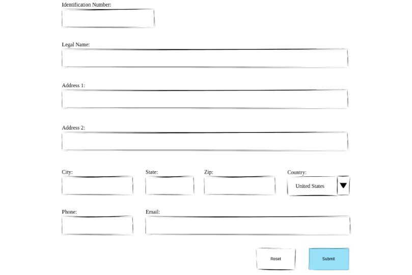
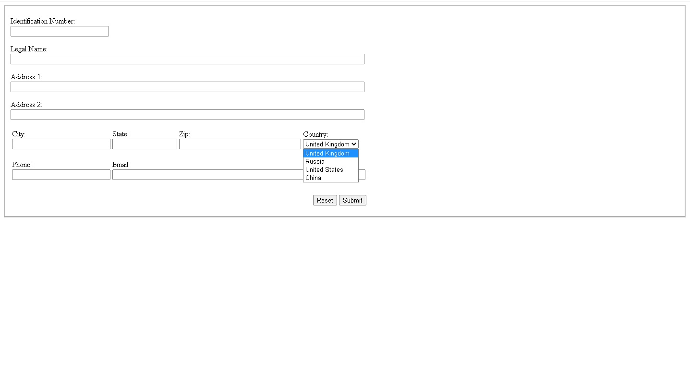
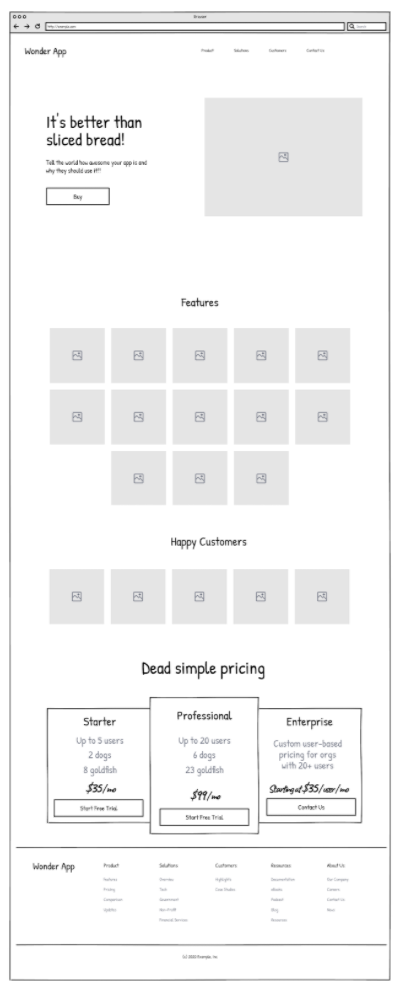
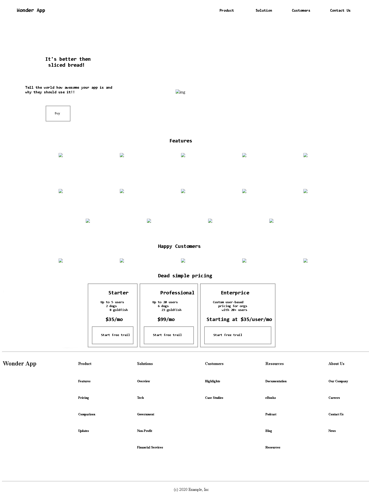

<h2 align ="center">МИНИСТЕРСТВО НАУКИ И ВЫСШЕГО ОБРАЗОВАНИЯ РОССИЙСКОЙ ФЕДЕРАЦИИ<br>

<p align ="center">ФЕДЕРАЛЬНОЕ ГОСУДАРСТВЕННОЕ БЮДЖЕТНОЕ ОБРАЗОВАТЕЛЬНОЕ<br>

<p align ="center">УЧРЕЖДЕНИЕ ВЫСШЕГО ОБРАЗОВАНИЯ<br>

<p align ="center">«ВЯТСКИЙ ГОСУДАРСТВЕННЫЙ УНИВЕРСИТЕТ»<br>

<p align ="center">Институт математики и информационных систем<br>

<p align ="center">Факультет автоматики и вычислительной техники<br>

<h2 align ="center">Кафедра систем автоматизации управления<br></h2>

<br>

<br>

<br>

<br>

<br>

<br>

<br>

<br>

<br>

<p align= "center"><b>Изучение блочных элементов и компонентов разметки форм в HTML5</b><br>

<p align= "center">Отчет по лабораторной работе № 2<br>

<p align= "center">по дисциплине<br>

<p align= "center">Основы frontend-разработки и организации человеко-машинного интерфейса<br></p>

<p align= "center">Вариант № 2<br></p>

<br>

<br>

<br>

<br>

<br>

<br>

<p align="center">Выполнил студент гр. ИТб-1301-01-00 _________________ /Кашин А.В./<br>

<p align="center">Руководитель ст. преподаватель _________________ /Земцов М.А./<br></p>

<br>

<br>

<br>

<br>

<br>

<p align="center">Киров 2021</p>


<hr>Цель лабораторной работы: изучение блочных элементов и компонентов разметки форм в HTML5.<br>

<br>

Задачи лабораторной работы:<br>

<ol><li>Организовать процесс работы над лабораторной работой</li>

<li>Изучить типовые блочные элементы html5 документа</li>

<li>Изучить типовые элементы построения форм html5 документа</li>

<li>Выполнить самостоятельное задание</li>

<li>Составить отчет по выполненным задачам</li>

<li>Защитить лабораторную работу</li></ol>

<br>

<h3>Ход работы</h3>

<br>

<h4>Задание 1</h4>

<p>Создайте в репозитории “Basic frontend dev labs” ветвь “lab2” от стартового коммита главной ветви. Переключитесь на ветвь lab2 для работы над лабораторной работой и сохранения всех результатов</p>

<br>

<h4>Задание 2</h4>

<p>Изучить типовые блочные элементы html5 документа</p>

<br>

<h4>Задание 3</h4>

<p>Изучить типовые элементы построения форм html5 документа</p>

<p>Разработайте макет формы регистрации пользователя, представленный ниже на рисунке 1<p>


<br>

<p>Завершённый макет представлен на рисунке 2<p>

<p> Листинг страницы с анкетой представлен в приложении А.</p>

<br>


<h4>Задание 4</h4>

<p>На основании изученного материала постройте макет html страницы в зависимости от варианта. Макет представлен на рисунке 3.</p>

<br>

<p>Завершённый макет представлен на рисунке 4<p>

<p> Листинг страницы с анкетой представлен в приложении А.</p>

<br>

<p align="center"></a>

<p align="center">Рисунок 1 – Таблица по заданию 3</p>


<br>

<p align="center"></a>

<p align="center">Рисунок 2 – Страница с анкетой</p>

<br>

<p align="center"></a>

<p align="center">Рисунок 3 – Страница по заданию 4</p>

<br>


<br>

<p align="center"></a>

<p align="center">Рисунок 4 – Страница по заданию 4</p>

<br>


<br>

<p> Листинг базовой страницы index4.html представлен в приложении А.</p>


<p> Вывод: в ходе работы были изучены типовые элементы структуры html документов и получены навыки в их формировании. Также были исследованы функциональные возможности инструментов разработчика на стороне браузера и язык разметки markdown.</p>


<br>

<p align="center">Приложение А</p>

<p align="center">(обязательное) </p>

<p align="center">Листинг страницы по заданию 3</p>

    <!DOCTYPE HTML>
    <html>
    <head>
        <meta http-equiv="Content-Type" content="text/html; charset=utf-8">
        <title>Кашин Алексей Владимирович</title>
    </head>
    <body>
        <fieldset>
            <form action=mailto:ivanmor2002@gmail.com enctype="text/plain" name="maket" autocomplete="on">
                <p><label for="number">Identification Number:</label><br><input autocomplete=on autofocus type="text" id="number" size="24" required></p>
                <p><label for="name">Legal Name:</label><br><input autocomplete=on type="text" id="name" size="100" required></p>
                <p><label for="Address1">Address 1:</label><br><input autocomplete=on type="text" id="Address1" size="100" required></p>
                <p><label for="Address2">Address 2:</label><br><input autocomplete=on type="text" id="Address2" size="100"></p>
                <table>
                    <tr>
                        <td><label for="City">City:</label><br><input autocomplete=on type="text" id="City" size="24" required></td>
                        <td><label for="State">State:</label><br><input autocomplete=on type="text" id="State" size="14" required></td>
                        <td><label for="Zip">Zip:</label><br><input autocomplete=on type="text" id="Zip" size="31" required></td>
                        <td>Country:<br><select>
                            <option value=1 selected>United Kingdom</option>
                            <option value=2>Russia</option>
                            <option value=3>United States</option>
                            <option value=4>China</option>
                    </select></td>
                    </tr>
                </table>
                <p></p>
                <table>
                    <tr>
                        <td><label for="Phone">Phone:</label><br><input autocomplete=on type="text" id="Phone" size="24" required></td>
                        <td><label for="Email">Email:</label><br><input autocomplete=on type="email" id="Email" size="70" required></td>
                    </tr>
                </table>
                <p></p>
                <table>
                    <tr>
                        <td><pre>                                                                                         </pre></td>
                        <td><button type="reset">Reset</button></td>
                        <td><input type="submit" value="Submit"></td>
                    </tr>
                </table>
            </form>
        </fieldset>
    </body>
    </html>


<br>

<p align="center">Приложение Б</p>

<p align="center">(обязательное) </p>

<p align="center">Листинг страницы по заданию 4</p>

```<!DOCTYPE HTML>
<html>
 <head>
    <meta http-equiv="Content-Type" content="text/html; charset=utf-8">
    <title>Кашин Алексей Владимирович</title>
 </head>
<body>
    <header class="header">
        <div class="class">
            <table>
                <tr>
                    <td><h2><pre>     Wonder App                                                             </pre></h2></td>

                    <td><h3><pre>Product          </pre></h3></td>
                    <td><h3><pre>Solution         </pre></h3></td>
                    <td><h3><pre>Customers         </pre></h3></td>
                    <td><h3><pre>Contact Us         </pre></h3></td>
                </tr>
            </table>
        </div>
    </header>

    <main class="page content">
        <section class="">
            <div class="">
                <table>
                    <tr>
                        <td><pre>             


                        </pre></td>
                    </tr>
                    <tr>
                        <td><h1><pre>               It's better then<br>                sliced bread!
                        </pre></h1></td>
                    </tr>
                    <tr>
                        <td colspan="3"><h3><pre>           Tell the world how awesome your app is and<br>           why they should use it!!
                        </pre></h3></td>
                        <td rowspan="4"><pre>                                  </pre></td>
                        <td rowspan="4"></td>
                    </tr>
                    <tr>
                        <table>
                            <td><pre>                       </pre></td>
                            <td width="100">
                                <fieldset>
                                    <pre>   Buy</pre>
                                </fieldset>
                            </td>
                        </table>
                    </tr>
                </table>
            </div>
        </section>
        <section class="">
            <div class="">
                <br>
                <br>
                    <h1><pre>                                                           Features</pre></h1>
                <table>
                    <tr>
                        <td>
                            <pre>                               </pre>
                        </td>
                        <td>
                            <pre>                               </pre>
                        </td>
                        <td>
                            <pre>                               </pre>
                        </td>
                        <td>
                            <pre>                               </pre>
                        </td>
                        <td>
                            <pre>                               </pre>
                        </td>
                    </tr>
                </table>
                <table>
                    <tr>
                        <pre>


                           
                        </pre>
                    </tr>
                    <tr>
                        <td>
                            <pre>                               </pre>
                        </td>
                        <td>
                            <pre>                               </pre>
                        </td>
                        <td>
                            <pre>                               </pre>
                        </td>
                        <td>
                            <pre>                               </pre>
                        </td>
                        <td>
                            <pre>                               </pre>
                        </td>
                    </tr>
                </table>
                <table>
                    <tr>
                        <pre>


                           
                        </pre>
                    </tr>
                <table>
                    <tr>
                        <td>
                            <pre>                                              </pre>
                        </td>
                        <td>
                            <pre>                               </pre>
                        </td>
                        <td>
                            <pre>                               </pre>
                        </td>
                        <td>
                            <pre>                               </pre>
                        </td>
                    </tr>
                </table>
                <br>
                <br>
            </div>
        </section>
        <section class="">
            <div class="">
                <h1><pre>                                                       Happy Customers</pre></h1>
                <table>
                    <tr>
                        <td>
                            <pre>                               </pre>
                        </td>
                        <td>
                            <pre>                               </pre>
                        </td>
                        <td>
                            <pre>                               </pre>
                        </td>
                        <td>
                            <pre>                               </pre>
                        </td>
                        <td>
                            <pre>                               </pre>
                        </td>
                    </tr>
                </table>
            </div>
        </section>
        <section class="">
            <div class="">
                <h1><pre>                                                       Dead simple pricing</pre></h1>
                <table>
                    <tr>
                        <td>
                        <fieldset><pre><h2>      Starter</h2></pre>
                            <pre><h4>     Up to 5 users<br>        2 dogs<br>          8 goldfish</h4></pre>
                            <pre><h2>     $35/mo</h2></pre>
                            <fieldset>
                                <pre><h4>   Start free trail</h4></pre>
                            </fieldset>
                        </fieldset>
                        </td>
                        <td>
                            <fieldset><pre><h2>      Professional</h2></pre>
                                <pre><h4>     Up to 20 users<br>        6 dogs<br>          23 goldfish</h4></pre>
                                <pre><h2>     $99/mo</h2></pre>
                                <fieldset>
                                    <pre><h4>   Start free trail</h4></pre>
                                </fieldset>
                            </fieldset>
                        </td>
                        <td>
                            <fieldset><pre><h2>      Enterprice</h2></pre>
                                <pre><h4>     Custom user-based<br>        pricing for orgs<br>          with 20+ users</h4></pre>
                                <pre><h2> Starting at $35/user/mo</h2></pre>
                                <fieldset>
                                    <pre><h4>   Start free trail</h4></pre>
                                </fieldset>
                            </fieldset>
                        </td>
                    </tr>
                </table>
                
            </div>
        </section>
    </main>
    <footer>
        <div class="footer">
            <hr>
            <table>
                <tr>
                    <td><h2>Wonder App</h2></td>
                    <td rowspan="6"><pre>                      </pre></td>
                    <td><h4>Product</h4></td>
                    <td rowspan="6"><pre>                      </pre></td>
                    <td><h4>Solutions</h4></td>
                    <td rowspan="6"><pre>                      </pre></td>
                    <td><h4>Customers</h4></td>
                    <td rowspan="6"><pre>                      </pre></td>
                    <td><h4>Resources</h4></td>
                    <td rowspan="6"><pre>                      </pre></td>
                    <td><h4>About Us</h4></td>
                </tr>
                    <tr>
                    <td></td>    
                    <td><h5>Features</h5></td>
                    <td><h5>Overview</h5></td>
                    <td><h5>Highlights</h5></td>
                    <td><h5>Documentation</h5></td>
                    <td><h5>Our Company</h5></td>
                </tr>
                <tr>
                    <td></td>
                    <td><h5>Pricing</h5></td>
                    <td><h5>Tech</h5></td>
                    <td><h5>Case Studies</h5></td>
                    <td><h5>eBooks</h5></td>
                    <td><h5>Careers</h5></td>
                </tr>
                <tr>
                    <td></td>
                    <td><h5>Comparison</h5></td>
                    <td><h5>Government</h5></td>
                    <td></td>
                    <td><h5>Podcast</h5></td>
                    <td><h5>Contact Us</h5></td>
                </tr>    
                <tr>
                    <td></td>
                    <td><h5>Updates</h5></td>
                    <td><h5>Non-Profit</h5></td>
                    <td></td>
                    <td><h5>Blog</h5></td>
                    <td><h5>News</h5></td>
                </tr>
                <tr>
                    <td></td>
                    <td></td>
                    <td><h5>Financial Services</h5></td>
                    <td></td>
                    <td><h5>Resources</h5></td>
                    <td></td>
                </tr>
                <tr>
                    <td colspan="11"><pre>


                    </pre></td>
                </tr>
            </table>
        </div>
        <hr>
        <div class="footer2">
            <table>
                <tr>
                    <td><pre>                                                                                              </pre></td>
                    <td>(c) 2020 Example, Inc</td>
                </tr>
            </table>
        </div>
    </footer>
</body>
</html> 


